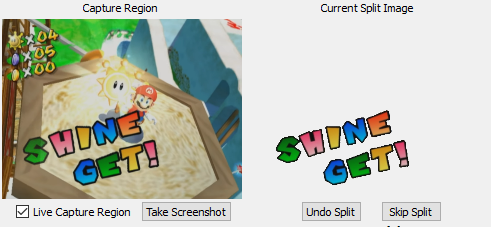

<!-- markdownlint-disable-next-line MD033 -->
#  AutoSplit  

Easy to use image comparison based auto splitter for speedrunning on console or PC.

This program can be used to automatically start, split, and reset your preferred speedrun timer by comparing images to a capture region. This allows you to focus more on your speedrun and less on managing your timer. It also improves the accuracy of your splits. It can be used in tandem with any speedrun timer that accepts hotkeys (LiveSplit, wsplit, etc.), and can be integrated with LiveSplit.

# TUTORIAL

## DOWNLOAD AND OPEN

- Download the [latest version](/../../releases/latest)

### Compatibility

- Python 3.9+
- Windows 10 and 11.

### Building

(This is not required for normal use)

- Python 3.9 - 3.10.
- Microsoft Visual C++ 14.0 or greater may be required to build the executable. Get it with [Microsoft C++ Build Tools](https://visualstudio.microsoft.com/visual-cpp-build-tools/).

- Read [requirements.txt](/scripts/requirements.txt) for more information on how to install, run and build the python code.
  - Run `./scripts/install.ps1` to install all dependencies.
  - Run the app directly with `./scripts/start.ps1 [--auto-controlled]`.
  - Run `./scripts/build.ps1` to build an executable.
- Recompile resources after modifications by running `./scripts/compile_resources.ps1`.
- All configured for VSCode, including Run (F5) and Build (Ctrl+Shift+B) commands.

## OPTIONS

#### Split Image Folder

- Supported image file types: .png, .jpg, .jpeg, .bmp, and [more](https://docs.opencv.org/3.0-beta/modules/imgcodecs/doc/reading_and_writing_images.html#imread).
- Images can be any size.
- Images are matched in alphanumerical order.
- Recommended filenaming convention: `001_SplitName.png, 002_SplitName.png, 003_SplitName.png`...
- Custom split image settings are handled in the filename. See how [here](#custom-split-image-settings).
- To create split images, it is recommended to use AutoSplit's Take Screenshot button for accuracy. However, images can be created using any method including Print Screen and [Snipping Tool](https://support.microsoft.com/en-us/help/4027213/windows-10-open-snipping-tool-and-take-a-screenshot).

#### Capture Region

- This is the region that your split images are compared to. Usually, this is going to be the full game screen.
- Click "Select Region".
- Click and drag to form a rectangle over the region you want to capture.
- Adjust the x, y, width, and height of the capture region manually to make adjustments as needed.
- If you want to align your capture region by using a reference image, click "Align Region".
- You can freely move the window that the program is capturing, but resizing the window will cause the capture region to change.
- Once you are happy with your capture region, you may unselect Live Capture Region to decrease CPU usage if you wish.
- You can save a screenshot of the capture region to your split image folder using the Take Screenshot button.

#### Avg. FPS

- Calculates the average comparison rate of the capture region to split images. This value will likely be much higher than needed, so it is highly recommended to limit your FPS depending on the frame rate of the game you are capturing.

### Settings

#### Comparison Method

- There are three comparison methods to choose from: L2 Norm, Histograms, and Perceptual Hash (or pHash).
  - L2 Norm: This method should be fine to use for most cases. It finds the difference between each pixel, squares it, sums it over the entire image and takes the square root. This is very fast but is a problem if your image is high frequency. Any translational movement or rotation can cause similarity to be very different.
  - Histograms: An explanation on Histograms comparison can be found [here](https://mpatacchiola.github.io/blog/2016/11/12/the-simplest-classifier-histogram-intersection.html). This is a great method to use if you are using several masked images.
  - Perceptual Hash: An explanation on pHash comparison can be found [here](http://www.hackerfactor.com/blog/index.php?/archives/432-Looks-Like-It.html). It is highly recommended to NOT use pHash if you use masked images. It is very inaccurate.

#### Capture Method

- **BitBlt** (fastest, least compatible)  
    A good default fast option. But it cannot properly record OpenGL, Hardware Accelerated or Exclusive Fullscreen windows.  
    The smaller the selected region, the more efficient it is.  
- **Windows Graphics Capture** (fast, most compatible, capped at 60fps)  
    Only available in Windows 10.0.17134 and up.  
    Due to current technical limitations, Windows versions below 10.0.0.17763 require having at least one audio or video Capture Device connected and enabled.
    Allows recording UWP apps, Hardware Accelerated and Exclusive Fullscreen windows.  
    Adds a yellow border on Windows 10 (not on Windows 11).
    Caps at around 60 FPS.  
- **Direct3D Desktop Duplication** (slower, bound to display)  
    Duplicates the desktop using Direct3D.  
    It can record OpenGL and Hardware Accelerated windows.  
    About 10-15x slower than BitBlt. Not affected by window size.  
    overlapping windows will show up and can't record across displays.  
- **Force Full Content Rendering** (very slow, can affect rendering pipeline)  
    Uses BitBlt behind the scene, but passes a special flag to PrintWindow to force rendering the entire desktop.  
    About 10-15x slower than BitBlt based on original window size and can mess up some applications' rendering pipelines.  
- **Video Capture Device**
    Uses a Video Capture Device, like a webcam, virtual cam, or capture card.  
    There are currently performance issues, but it might be more convenient.  
    If you want to use this with OBS' Virtual Camera, use the [Virtualcam plugin](https://github.com/Avasam/obs-virtual-cam/releases) instead.  

#### Capture Device

Select the Video Capture Device that you wanna use if selecting the `Video Capture Device` Capture Method. Will show `[occupied]` if a device is detected but can't be started.

#### Show Live Similarity

- Displays the live similarity between the capture region and the current split image. This number is between 0 and 1, with 1 being a perfect match.

#### Show Highest Similarity

- Shows the highest similarity between the capture region and current split image.

#### Current Similarity Threshold

- When the live similarity goes above this value, the program hits your split hotkey and moves to the next split image.

#### Default Similarity Threshold

- This value will be set as the threshold for an image if there is no custom threshold set for that image.

#### Pause Time

- Time in seconds that the program stops comparison after a split. Useful for if you have two of the same split images in a row and want to avoid double-splitting. Also useful for reducing CPU usage.

#### Default Pause Time

- This value will be set as the Pause Time for an image if there is no custom Pause Time set for that image.

#### Delay Time

- Time in milliseconds that the program waits before hitting the split hotkey for that specific split.

#### Dummy splits when undoing / skipping

AutoSplit will group dummy splits together with a real split when undoing/skipping. This basically allows you to tie one or more dummy splits to a real split to keep it as in sync as possible with the real splits in LiveSplit/wsplit. If they are out of sync, you can always use "Previous Image" and "Next Image".

Examples:
Given these splits: 1 dummy, 2 normal, 3 dummy, 4 dummy, 5 normal, 6 normal.

In this situation you would have only 3 splits in LiveSplit/wsplit (even though there are 6 split images, only 3 are "real" splits). This basically results in 3 groups of splits: 1st split is images 1 and 2. 2nd split is images 3, 4 and 5. 3rd split is image 6.

- If you are in the 1st or 2nd image and press the skip key, it will end up on the 3rd image
- If you are in the 3rd, 4th or 5th image and press the undo key, it will end up on the 2nd image
- If you are in the 3rd, 4th or 5th image and press the skip key, it will end up on the 6th image
- If you are in the 6th image and press the undo key, it will end up on the 5th image

#### Loop Split Images

If this option is enabled, when the last split meets the threshold and splits, AutoSplit will loop back to the first split image and continue comparisons.
If this option is disabled, when the last split meets the threshold and splits, AutoSplit will stop running comparisons.
This option does not loop single, specific images. See the Custom Split Image Settings section above for this feature.

#### Auto Start On Reset

If this option is enabled, when the reset hotkey is hit, the reset button is pressed, or the reset split image meets its threshold, AutoSplit will reset and automatically start again back at the first split image.
If this option is disabled, when the reset hotkey is hit, the reset button is pressed, or the reset split image meets its threshold, AutoSplit will stop running comparisons.

### Custom Split Image Settings

- Each split image can have different thresholds, pause times, delay split times, loop amounts, and can be flagged.
- These settings are handled in the image's filename.
- Custom thresholds are place between parenthesis `()` in the filename. This value will override the default threshold.
- Custom pause times are placed between square brackets `[]` in the filename. This value will override the default pause time.
- Custom delay times are placed between hash signs `##` in the filename. Note that these are in milliseconds. For example, a 10 second split delay would be `#10000#`. You cannot skip or undo splits during split delays.
- A different comparison method can be specified with their 0-base index between carets `^^`:
  - `^0^`: L2 Norm
  - `^1^`: Histogram
  - `^2^`: Perceptual Hash
- Image loop amounts are placed between at symbols `@@` in the filename. For example, a specific image that you want to split 5 times in a row would be `@5@`. The current loop # is conveniently located beneath the current split image.
- Flags are placed between curly brackets `{}` in the filename. Multiple flags are placed in the same set of curly brackets. Current available flags:
  - `{d}` dummy split image. When matched, it moves to the next image without hitting your split hotkey.
  - `{b}` split when similarity goes below the threshold rather than above. When a split image filename has this flag, the split image similarity will go above the threshold, do nothing, and then split the next time the similarity goes below the threshold.
  - `{p}` pause flag. When a split image filename has this flag, it will hit your pause hotkey rather than your split hokey.
- Filename examples:
  - `001_SplitName_(0.9)_[10].png` is a split image with a threshold of 0.9 and a pause time of 10 seconds.
  - `002_SplitName_(0.9)_[10]_{d}.png` is the second split image with a threshold of 0.9, pause time of 10, and is a dummy split.
  - `003_SplitName_(0.85)_[20]_#3500#.png` is the third split image with a threshold of 0.85, pause time of 20 and has a delay split time of 3.5 seconds.
  - `004_SplitName_(0.9)_[10]_#3500#_@3@_{b}.png` is the fourth split image with a threshold of 0.9, pause time of 10 seconds, delay split time of 3.5 seconds, will loop 3 times, and will split when similarity is below the threshold rather than above.
  
## Special images

### How to Create a Masked Image

Masked images are very useful if only a certain part of the capture region is consistent (for example, consistent text on the screen, but the background is always different). Histogram or L2 norm comparison is recommended if you use any masked images. It is highly recommended that you do NOT use pHash comparison if you use any masked images, as it is very inaccurate.

The best way to create a masked image is to set your capture region as the entire game screen, take a screenshot, and use a program like [paint.net](https://www.getpaint.net/) to "erase" (make transparent) everything you don't want the program to compare. More on creating images with transparency using paint.net can be found in [this tutorial](https://www.youtube.com/watch?v=v53kkUYFVn8). For visualization, here is what the capture region compared to a masked split image looks like if you would want to split on "Shine Get!" text in Super Mario Sunshine:

### Reset image

You can have one (and only one) image with the keyword `reset` in its name. AutoSplit will press the reset button when it finds this image. This image will only be used for resets and it will not be tied to any split. You can set a probability and pause time for it. The pause time is the amount of seconds AutoSplit will wait before checking for the reset image once the run starts. For example: `Reset_(0.95)_[10].png`.

### Start image

The start image is similar to the reset image. You can only have one start image with the keyword `start_auto_splitter`.You can reload the image using the "`Reload Start Image`" button. The pause time is the amount of seconds AutoSplit will wait before checking for the start image once a run ends/is reset. Delay times will be used to delay starting your timer after the threshold is met. If you need to pause comparison for any amount of time after the Start Image, the best option right now is to use a dummy split image `{d}` with a similarity threshold of `(0.00)` and a pause threshold `[]` of however long you need to pause comparison as your first split image. This will trigger the pause immediately after your timer is started.

### Profiles

- Profiles are saved under `%appdata%\AutoSplit\profiles` and use the extension `.toml`. Profiles can be saved and loaded by using File -> Save Profile As... and File -> Load Profile.
- The profile contains all of your settings, including information about the capture region.
- You can save multiple profiles, which is useful if you speedrun multiple games.
- If you change your display setup (like using a new monitor, or upgrading to Windows 11), you may need to readjust or reselect your Capture Region.

## Timer Integration

### Timer Global Hotkeys

- Click "Set Hotkey" on each hotkey to set the hotkeys to AutoSplit. The Start / Split hotkey and Pause hotkey must be the same as the one used in your preferred timer program in order for the splitting/pausing to work properly.
- Make sure that Global Hotkeys are enabled in your speedrun timer.
- All of these actions can also be handled by their corresponding buttons.
- Note that pressing your Pause Hotkey does not serve any function in AutoSplit itself and is strictly used for the Pause flag.

### LiveSplit Integration

The AutoSplit LiveSplit Component will directly connect AutoSplit with LiveSplit. LiveSplit integration is only supported in AutoSplit v1.6.0 or higher. This integration will allow you to:

- Use hotkeys directly from LiveSplit to control AutoSplit and LiveSplit together
- Load AutoSplit and any AutoSplit profile automatically when opening a LiveSplit layout.

#### LiveSplit Integration Tutorial

- Click [here](https://github.com/Toufool/LiveSplit.AutoSplitIntegration/raw/main/update/Components/LiveSplit.AutoSplitIntegration.dll) to download the latest component.
- Place the .dll file into your `[...]\LiveSplit\Components` folder.
- Open LiveSplit -> Right Click -> Edit Layout -> Plus Button -> Control -> AutoSplit Integration.
- Click Layout Settings -> AutoSplit Integration
- Click the Browse buttons to locate your AutoSplit Path (path to AutoSplit.exe) and Profile Path (path to your AutoSplit `.toml` profile file) respectively.
  - If you have not yet set saved a profile, you can do so using AutoSplit, and then go back and set your Settings Path.
- Once set, click OK, and then OK again to close the Layout Editor. Right click LiveSplit -> Save Layout to save your layout. AutoSplit and your selected profile will now open automatically when opening that LiveSplit Layout `.lsl` file.

## Known Limitations

- For many games, it will be difficult to find a split image for the last split of the run.
- The window of the capture region cannot be minimized.

## Resources

Still need help?

- [Open an issue](../../issues)
- Join the [AutoSplit Discord](https://discord.gg/Qcbxv9y)

## Credits

- Created by [Toufool](https://twitter.com/Toufool) and [Faschz](https://twitter.com/faschz).
- [Harutaka Kawamura](https://github.com/harupy/) for the snipping tool code that I used to integrate into the autosplitter.
- [amaringos](https://twitter.com/amaringos) for the icon.
- [Zana_G](https://www.twitch.tv/zana_g) for motivating me to start this project back up and for all of the time spent testing and suggesting improvements.
- [Avasam](https://twitter.com/Avasam06) for their continued work on making an incredible amount of improvements and changes to AutoSplit while I have not had the time/motivation to do so.
- [KaDiWa](https://github.com/KaDiWa4) for the LiveSplit integration.
- [Tyron18](https://twitter.com/Tyron18_) for assisting with Windows 11 testing.

## Donate

If you enjoy using the program, please consider donating. Thank you!  

